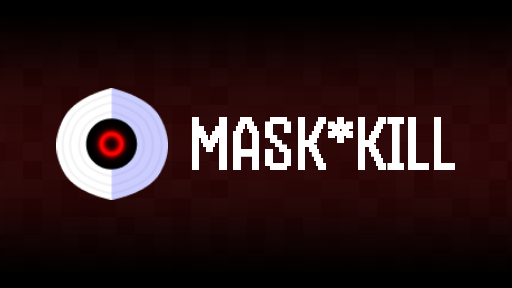
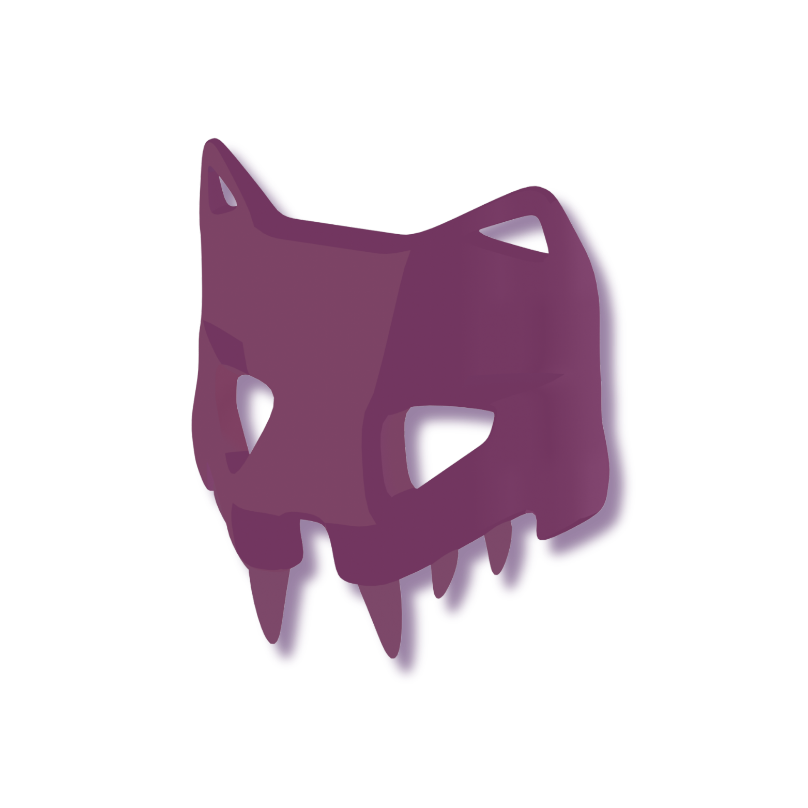
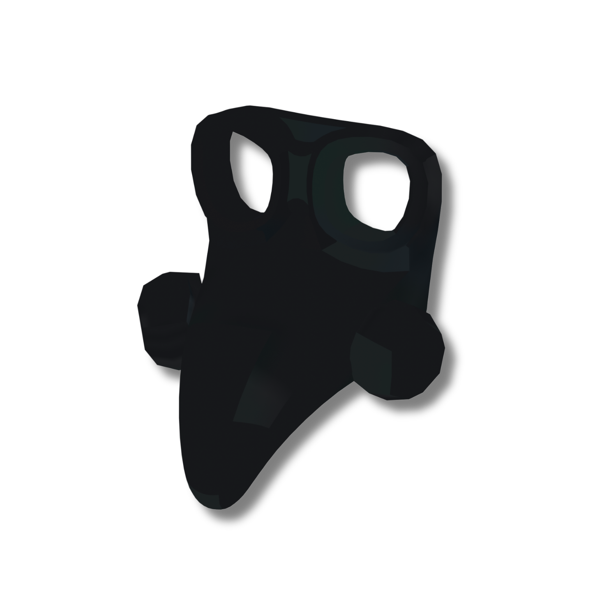
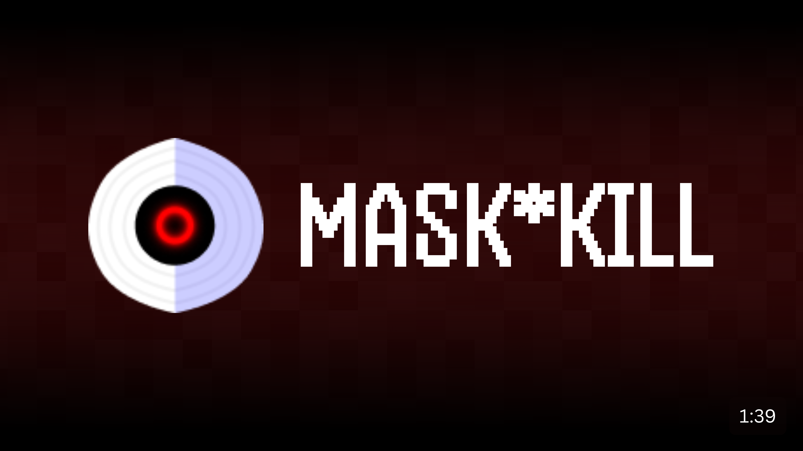
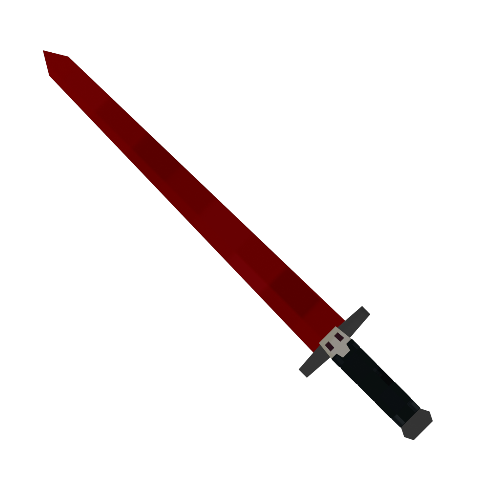
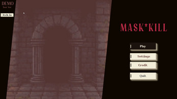
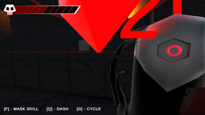
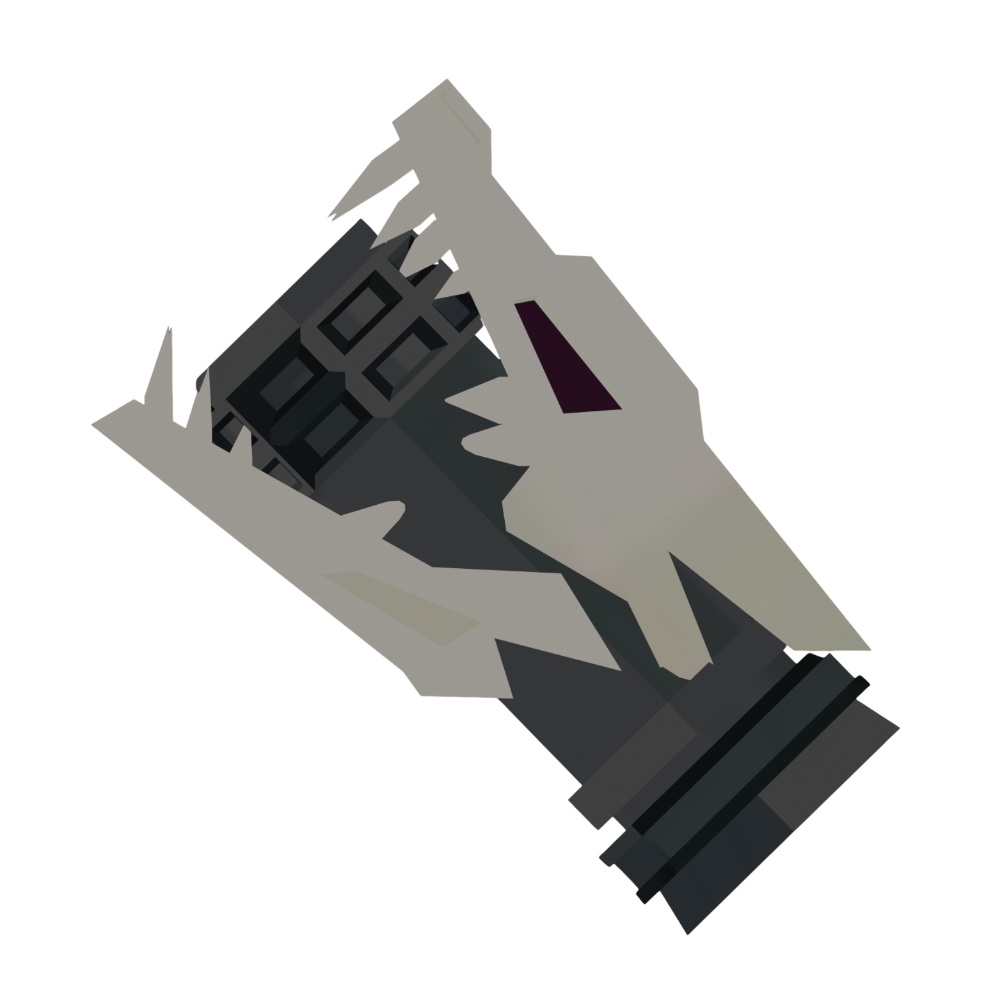

<table width="100%">
<tr>
<td align="left">
  
</td>

<td align="right" style="font-weight:600;">

<a href="#-about">ABOUT</a> &nbsp;•&nbsp;
<a href="#-features">FEATURES</a> &nbsp;•&nbsp;
<a href="#-trailer">TRAILER</a> &nbsp;•&nbsp;
<a href="#-preview">PREVIEW</a> &nbsp;•&nbsp;
<a href="#-controls">CONTROLS</a> &nbsp;•&nbsp;
<a href="#-team--ouroboroz-studios">TEAM</a>

</td>
</tr>
</table>

<p align="center">
  
</p>

<p align="center">
  <b>Follow Ton'A and his Quest to retrieve the Mask that held the fate of his people.</b><br>
  <i>Kill to Gain, Gain to Kill</i>
</p>

<p align="center">
  <a href="https://ouroboroz-studios.itch.io/deal">
    
  </a>
  
</p>

---

#  ABOUT

For generations, the Top’Peng Tribe drew their strength from sacred Masks — ancient relics that carried the spirits of elder beings. These Masks were not objects of worship, but a covenant of power passed down through chosen warriors.

Ton’A, eldest child of the chieftain, was destined to inherit this legacy during the Ceremony of Bestowment.

But on that night, the sky tore open.

A forgotten god, enraged by the tribe’s refusal to worship him, descended upon the village and stole every ancestral Mask. To break the tribe’s pride, he scattered them across cursed lands and awakened the dark entities that dwell there, commanding them to guard the stolen relics.

With his father’s final command echoing in his heart, Ton’A sets out into the forsaken wilds — unblessed, untested, but unbroken.

The Masks must be reclaimed.
The legacy must be restored.

---

#  FEATURES

<p align="center">

📝 **Interactive Note Board**  
Drag. Drop. Organize.

🎨 **Dynamic Color Shift**  
Cycle note colors instantly.

⚡ **Quick Edit System**  
Double-click to modify in real time.

🎮 **Game-Like Controls**  
Mouse-based intuitive interactions.

</p>

---

#  TRAILER

<p align="center">
  <a href="https://www.youtube.com/watch?v=I3Gs_Lijhn0">
    
  </a>
</p>

---

#  PREVIEW

<p align="center">
  
  
</p>

---

#  CONTROLS

```
┌──────────────────────────────┐
│        ADD / EDIT PANEL      │
├──────────────────────────────┤
│  TAB        → Switch field   │
└──────────────────────────────┘
```

```
┌──────────────────────────────┐
│          NOTE BOARD          │
├──────────────────────────────┤
│  M1         → Create / Drag  │
│  M1 x2      → Edit Note      │
│  M2         → Release        │
│  M2 x2      → Delete         │
│  M3         → Change Color   │
└──────────────────────────────┘
```

---

#  TEAM — OUROBOROZ STUDIOS

```
[ Rivo Nyawan Situmorang ]  → Leader
[ Terra Faqih Satria Madjid ]
[ Rizky Eko Pratama ]
[ Alya Ghaitsa Salsabila ]
[ Bella Fadhilla Khairunnisyah Effendi ]
[ Hasanun Nisa ]
```

---

#  VISION

```
> Productivity
> Interaction
> Engagement
> Fun
```

---

<p align="center">
  ⚡ Built with passion by 6 creators ⚡
</p>
