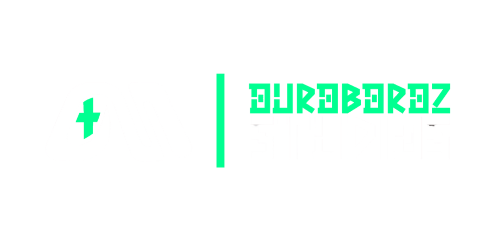

<!-- ============================================ -->
<!--                GAME PORTFOLIO               -->
<!-- ============================================ -->

  

---

  Indie Projects • Experimental Builds • Playable Prototypes

---

## Projects

---

<table>
<tr>

<td width="40%" align="center">

</td>

<td width="60%">

<h1>
  
  DEAL!
</h1>

DEAL is a cute, lightweight desktop productivity app built with Python + Pygame. It turns daily planning into a fun, visual, and stress-free experience — helping you track tasks and habits with no accounts, ads, or internet required.

Just open DEAL and plan your life with vibes.

 

</td>

</tr>
</table>

---

<table>
<tr>

<td width="40%" align="center">

</td>

<td width="60%">

<h1>
  
  MASK'KILL
</h1>

A tribal FPS roguelike where you reclaim sacred Masks scattered across cursed lands by a fallen god. Fight through cursed territories, recover ancient Masks, and restore your tribe’s legacy.

 

</td>

</tr>
</table>

---

## About

Short introduction about you or your team here.
